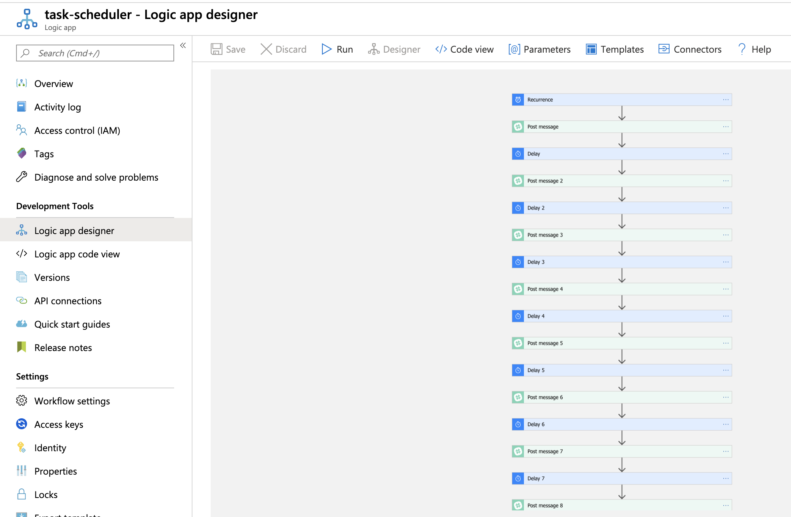

# [Day 02](https://github.com/marcusturewicz/25-days-of-serverless-challenge/tree/master/Day-02) of [25 days of serverless](https://www.25daysofserverless.com)

Lucy's Dilemma.

Azure Logic App using schedule tasks and Slack post messages to a Slack channel.

Created with Azure Portal and VS Code.

Slack channel link here: https://join.slack.com/t/lucysdilemma/shared_invite/enQtODU3NTE4MjEwODg2LTk2ZjcxMTBlMzA5ZWIxNDc3M2VjMzc2NTAyYjM3OTU5OGU3NmFmODJmYTU4MjYzY2NkMjEyY2Q0NDFhNTFkMjg

Scheduled to start on 13th Dec 08:00 Stockholm time.

Logic App:

Slack notification:

