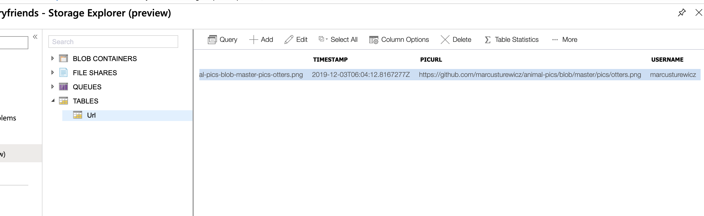
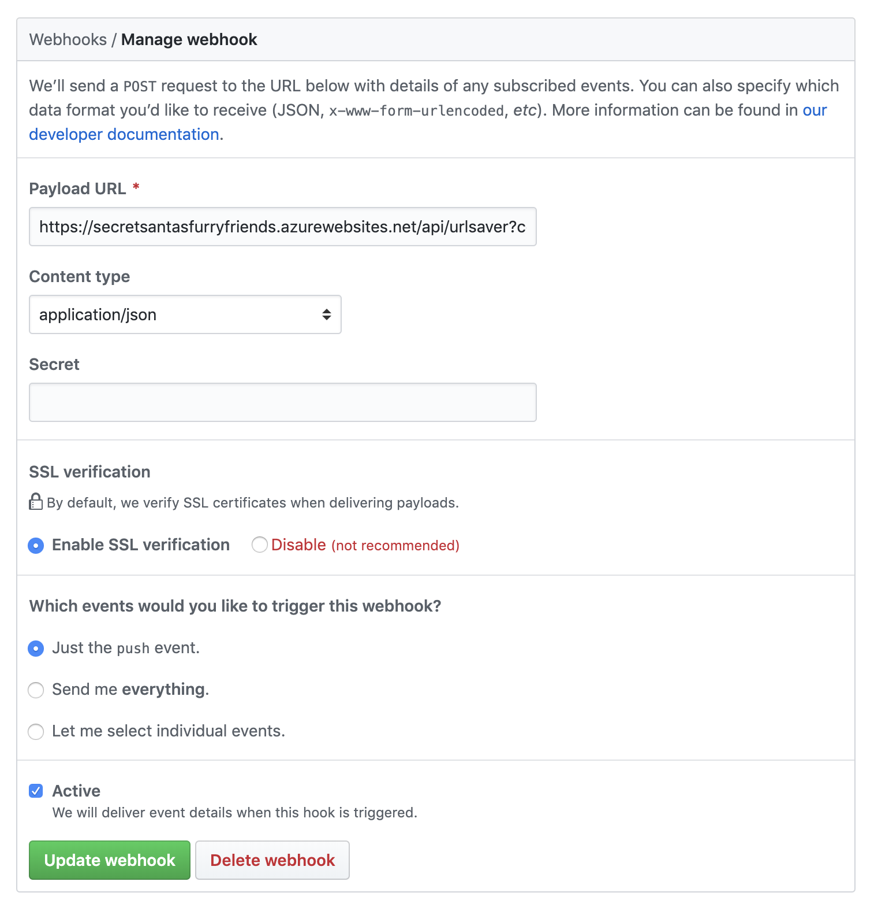

# Day 03 of [25 days of serverless](https://www.25daysofserverless.com)

[Secret Santa's Furry Friends](https://25daysofserverless.com/calendar/3)

Java Azure Function with HTTP trigger (GitHub webhook) with Table Storage as database.

Push a .png file to https://github.com/marcusturewicz/animal-pics (preferably /pics folder) and the function will save the URL to them in table storage.

Table Storage

GitHub Webhook

Created with VS Code.
