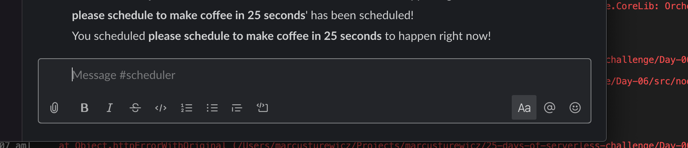

# Day 06 of [25 days of serverless](https://www.25daysofserverless.com)

[DURABLE APPS: Scheduler](https://25daysofserverless.com/calendar/6)

TypeScript Azure Durable Functions with notifications to slack via webhook using Slack SDK.

This was the winning app for Challenge 6!


## Prerequisites
1. Create a Slash Command in Slack, [docs here](https://api.slack.com/interactivity/slash-commands)
2. Create an incoming webhook in Slack, [docs here](https://api.slack.com/apps/AR4871ZR7/incoming-webhooks?)

## To run locally
1. Install Node.js, VS Code and Azure Functions Tools extension
2. Create a file `src/local.settings.json` that looks like this:
```json
  {
    "IsEncrypted": false,
    "Values": {
      "AzureWebJobsStorage": "<<STORAGE_ACCOUNT_CONNECTION_STRING>>",
      "FUNCTIONS_WORKER_RUNTIME": "node",
      "SLACK_WEBHOOK_URL": "<<SLACK_WEBHOOK_URL>>"
    }
  }
```
2. Press F5
3. Open Postman
4. POST the following body to this url: http://localhost:7071/api/naughtyornice:
```json
  {
    "text": "please schedule to make coffee in 25 seconds"
  }
```
5. Hit 'Send'
6. Observe the schedule confirmation message in Slack:


7. [However long later] obersve the schedule notification messgae in Slack:


## To run in Azure
1. Right click in VS Code left menu and click `Deploy to Function App...` 
2. Go to portal and add the following keys to the function app's APP SETTINGS, [docs here](https://docs.microsoft.com/en-us/azure/azure-functions/functions-how-to-use-azure-function-app-settings).
```text
      "SLACK_WEBHOOK_URL": "<<SLACK_WEBHOOK_URL>>"
```
3. You will need to update your Slash Command URL to point to the Azure one.

-- Created with VS Code.
