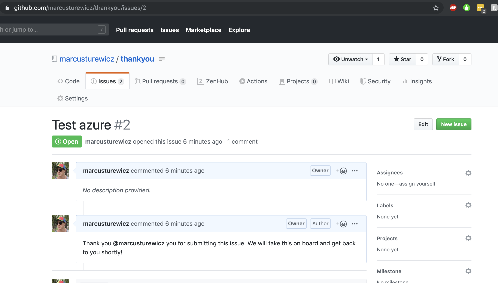

# Day 09 of [25 days of serverless](https://25daysofserverless.com)

[AUTOMATE YOUR GITHUB ISSUES WITH HOLIDAY MAGIC](https://25daysofserverless.com/calendar/9)

Python Azure Function triggered by GitHub webhook and thank you comment created with open source PyGithub pip package.

Create issues in https://github.com/marcusturewicz/thankyou and you will be thanked by me, serverlessly, of course!

## Prerequisities
1. Create personal access token, [docs here](https://help.github.com/en/github/authenticating-to-github/creating-a-personal-access-token-for-the-command-line)

## To run/test locally
1. Install Python 3.7.5, Azure Functions Tools, VS Code, Python extensions, Azure Functions extension and Postman
2. Create python virtual environment `python3 -m venv src/.venv`
3. Create `src/local.settings.json` with the following content:
```json
    {
        "IsEncrypted": false,
        "Values": {
            "AzureWebJobsStorage": "",
            "FUNCTIONS_WORKER_RUNTIME": "python",
            "GITHUB_PAT": "<<YOUR_GITHUB_PAT>>",
            "GITHUB_REPO": "<<YOUR_GITHUB_REPO>>"
        }
    }
```
    where `<<YOUR_GITHUB_REPO>>` is in the form `username/repository` e.g. `marcusturewicz/thankyou`.
4. Run app (F5)
5. Create an issue in your repo.
5. POST the content of `issue-event.json`, make sure the issue number matches issue created above.
6. A GitHub issue comment will be created.

## To run in Azure
1. Deploy to Azure using VS Code.
2. Add the following appsettings:
```text
    "GITHUB_PAT": "<<YOUR_GITHUB_PAT>>"
    "GITHUB_REPO": "<<YOUR_GITHUB_REPO>>"
```
3. Create a GitHub webhook on the repository you want to create issues in, [docs here](https://developer.github.com/webhooks/creating). Put the function URL from Azure into the webhook URL.

## See the thank you messages roll in!



-- Created with VS Code.
