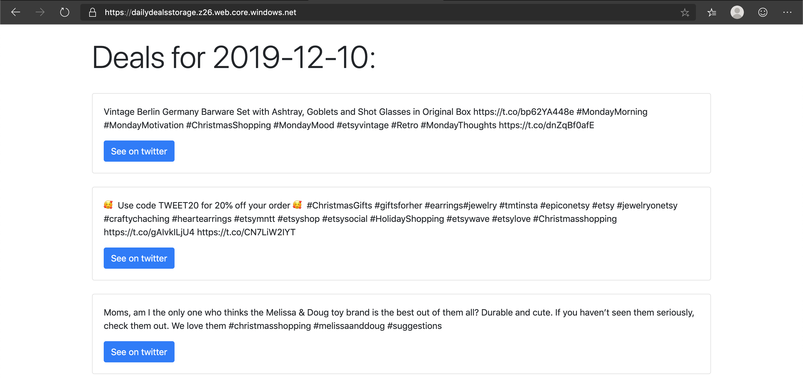
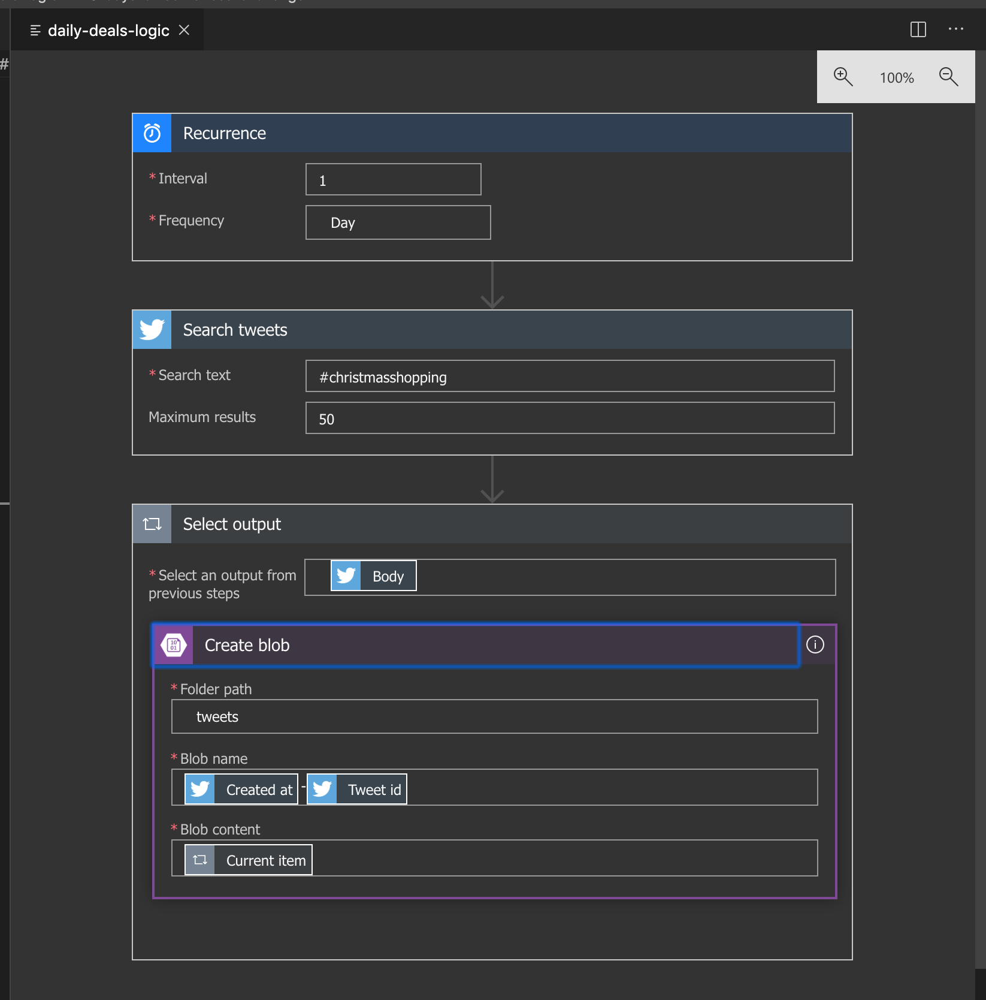

# Day 10 of [25 days of serverless](https://25daysofserverless.com)

[TIMER TRIGGER](https://25daysofserverless.com/calendar/10)

Azure Logic App with recurrence trigger searches tweets once a day, saves them in Azure Blob Storage. Then there is a statis website hosted in Azure Storage that pulls the tweets and displays them using Valinna JS.

### Live website here: https://dailydealsstorage.z26.web.core.windows.net

Logic app: 

-- Created with VS Code.
