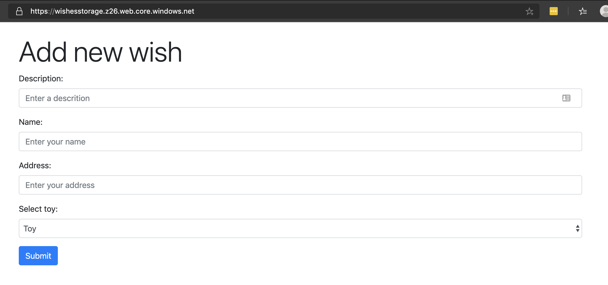

# Day 11 of [25 days of serverless](https://www.25daysofserverless.com)

[DATABASE TRIGGER](https://25daysofserverless.com/calendar/11)

Three Azure Functions for adding new wishes, notifying to slack and querying wishes and an
HTML page for posting new wishes via a UI. All deployed live to Azure.

### Architecture:

### UI: https://wishesstorage.z26.web.core.windows.net

### Every wish description sent to slack channel:

### Query URL returns all wishes for Santa: https://wishes-functionapp.azurewebsites.net/api/query

-- Created with VS Code.

