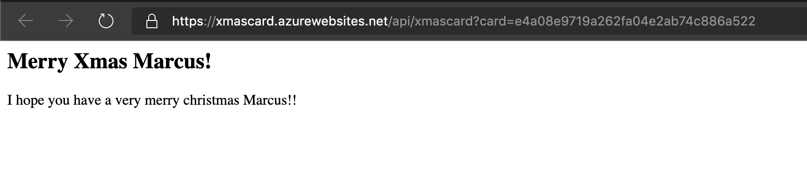

# Day 12 of [25 days of serverless](https://www.25daysofserverless.com)

[CACHING](https://25daysofserverless.com/calendar/12)

Javscript Azure Function to convert markdown Gist Xmas cards to HTML and cache in Redis.

## Usage
Supply the GIST ID in the query string e.g.:

`https://xmascard.azurewebsites.net/api/xmascard?card=e4a08e9719a262fa04e2ab74c886a522`

## Explanation
The function will try to get the content from Redis. If found, the cached value is returned, otherwise the markdown content
is converted to HTML using [showdown](https://github.com/showdownjs/showdown) and cahced in Redis and return to the client.

Example:

-- Created with VS Code.

