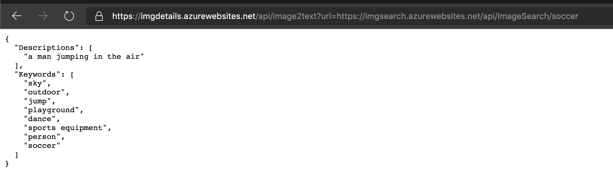

# Day 15 of [25 days of serverless](https://www.25daysofserverless.com)

[COGNITIVE SERVICES WITH COMPUTER VISION](https://25daysofserverless.com/calendar/15)

Java Azure Function with Azure Cognitive Services Computer Vision.

## Usage
Put an image url, e.g. a search from Challenge 7, into the query string:

https://imgdetails.azurewebsites.net/api/image2text?url=https://imgsearch.azurewebsites.net/api/ImageSearch/soccer

and you will receive a JSON response with the descriptions and keywords:

-- Created with VS Code.