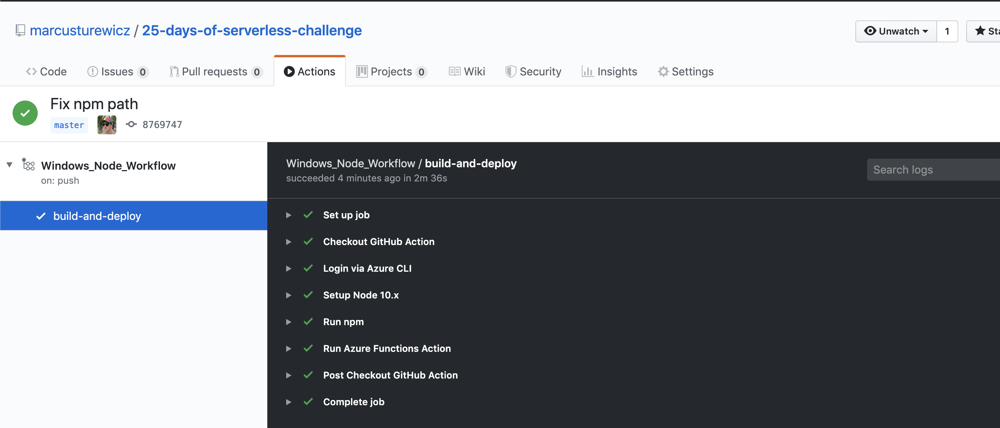

# Day 16 of [25 days of serverless](https://www.25daysofserverless.com)

[CI/CD](https://25daysofserverless.com/calendar/16)

Typescript Azure Function with Github Actions CI/CD.

## Usage
Call the following URL to see the upcoming dates:

https://posada-func.azurewebsites.net/api/Posadas

```json
[
  {
    "day": 16,
    "location": "Mexico City",
    "host": "Marcus Turewicz"
  },
  {
    "day": 17,
    "location": "Ecatepec",
    "host": "Marcus Turewicz"
  },
  {
    "day": 18,
    "location": "Guadalajara",
    "host": "Marcus Turewicz"
  },
  {
    "day": 19,
    "location": "Puebla",
    "host": "Marcus Turewicz"
  }
]
```

They are not all listed, so you can create a pull request to add the rest. Once approved,
the CI/CD pipeline will be triggered to build and deploy the function app.  



-- Created with VS Code.

