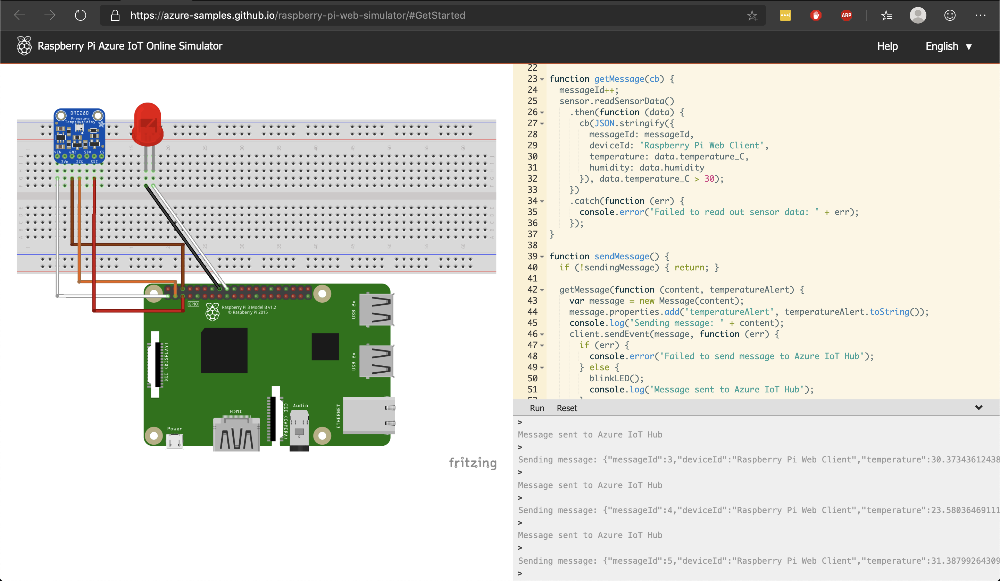
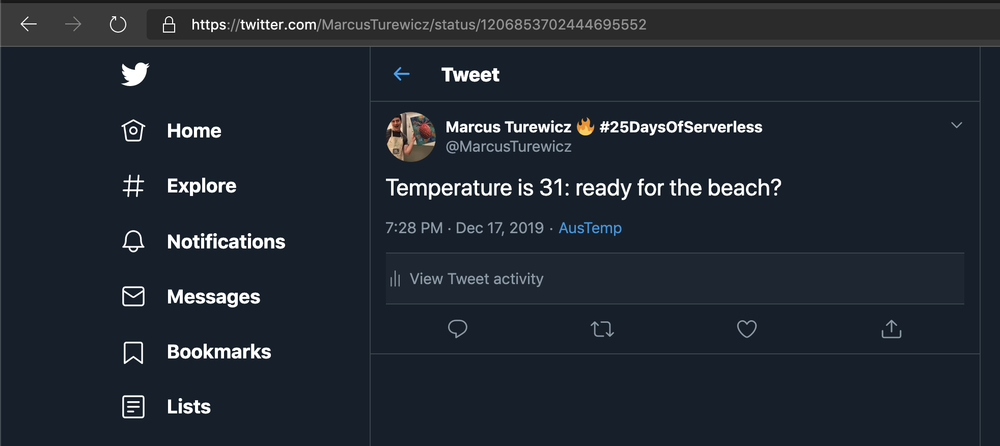

# Day 17 of [25 days of serverless](https://www.25daysofserverless.com)

[IOT and Functions](https://25daysofserverless.com/calendar/17)

Javascript Azure Function, Azure IOT Hub, Twitter App and Rasberry PI simulator.

Simulator working with IOT Hub:

Tweet send from Azure Function: https://twitter.com/MarcusTurewicz/status/1206816038530084864

-- Created with VS Code.

