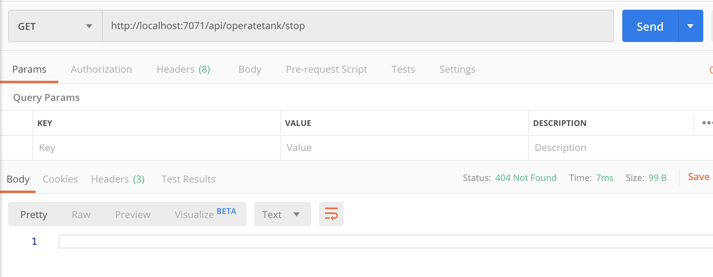
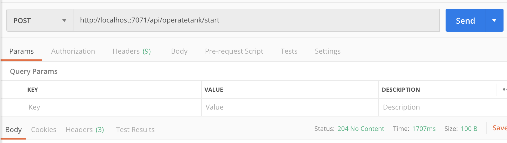
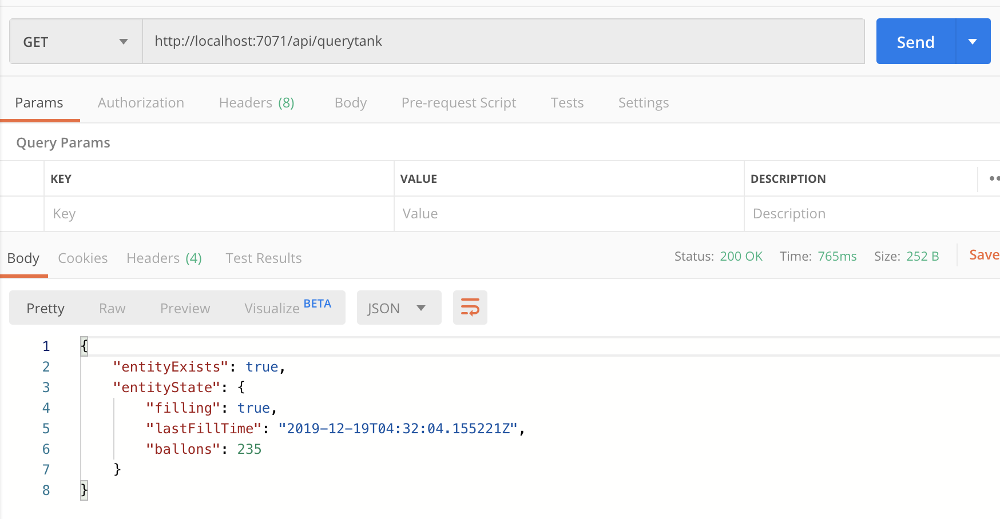

# Day 19 of [25 days of serverless](https://25daysofserverless.com)

[DURABLE ENTITIES](https://25daysofserverless.com/calendar/19)

C# Azure Functions with Durable Entities.

Utilises a `Tank` entity to store the state of:
- If the tank is being filled
- When the tank filling was last started
- How many balloons it can provide

There's endpoints to receive data from the IOT devices as well as an endpoint to get the current state of the tank.

Start filling tank:

Stop filling tank:

Query tank:

-- Created with VS Code.

