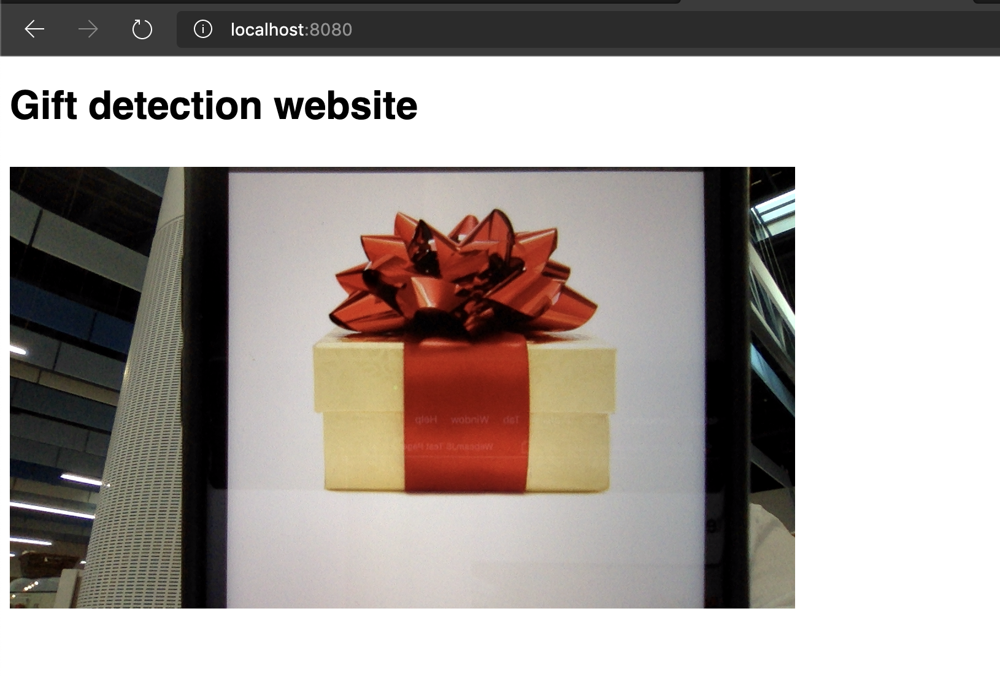
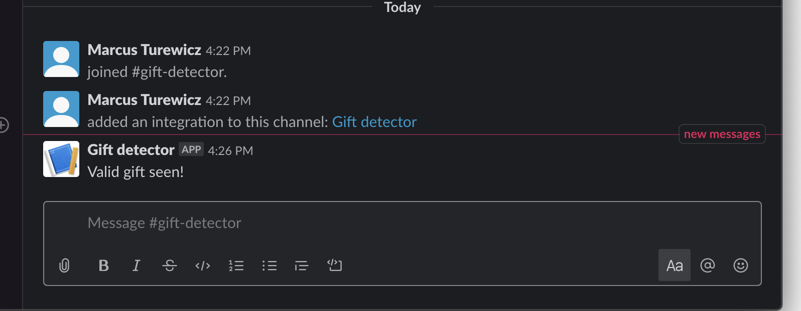

# Day 20 of [25 days of serverless](https://25daysofserverless.com)

[DURABLE ENTITIES](https://25daysofserverless.com/calendar/20)

C# Azure Function, Computer Vision, static website and static website.

Records a snapshot of your webcam every 2.5 secs and send the image to the function. The function uses
Azure Cognitive Services Computer Vision to analyse the image and send a notification to Slack if a
gift is detected.

Example:

Detected:

-- Created with VS Code.

