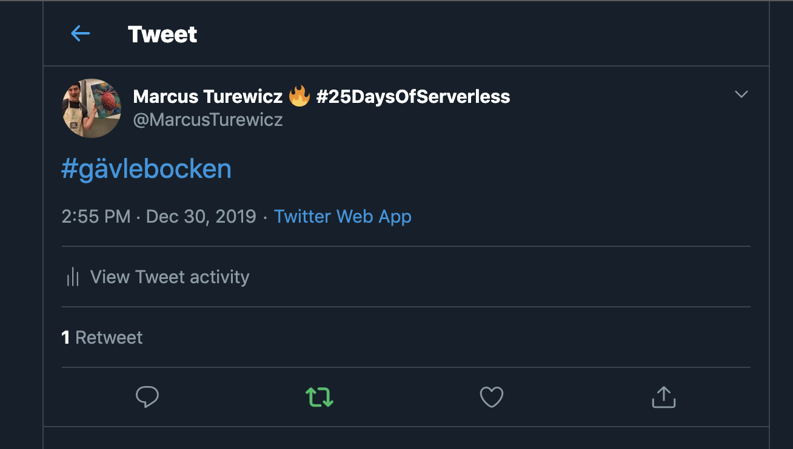

# Day 24 of [25 days of serverless](https://25daysofserverless.com)

[SECURITY AND INTEGRITY](https://25daysofserverless.com/calendar/24)

C# Azure Function, Key Vault, Managed Identity and Twitter webhooks.

Twitter app that retweets when tweets contain 'Gävlebocken'. All secrets stored in Key Vault
and accessed in function by Managed Identity.

-- Created with VS Code.
